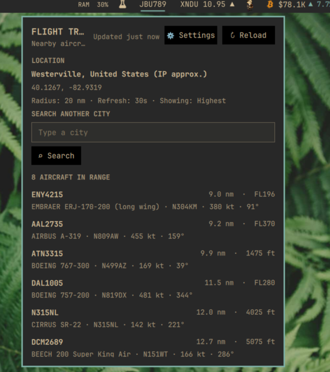

# Flight Tracker for Omarchy

A bar widget that shows nearby aircraft using free, key-free ADS-B data from
[adsb.fi](https://adsb.fi)'s [opendata API](https://github.com/adsbfi/opendata).
No feeder hardware, account, or API key required — just a live internet
connection.



## Highlights

- Bar label shows one featured aircraft's callsign, or just a count
- Pick which aircraft is featured: closest, lowest, highest, fastest, or
  slowest currently in range
- Configurable search radius (5–250 nautical miles) and refresh interval
  (30–600 seconds)
- In-panel **⚙ Settings** — no manual config-file editing needed
- Popup lists every aircraft in range (callsign, distance, altitude, type,
  registration, speed, heading), sorted by distance, with the featured one
  marked ★
- Location is detected automatically via IP geolocation, or you can search
  and pin any city manually
- Self-limits requests to stay within adsb.fi's public rate limit

## Use

Left-click the bar widget to open the panel.

| Control | Result |
| --- | --- |
| **↻ Reload** | Fetch aircraft data now |
| **⚙ Settings** | Show/hide the settings section (see below) |
| **⌕ Search** | Look up a city by name and pin your location to it |
| **⌖ Use current** | Switch back to automatic IP-based location |

## Configure

Open the panel and click **⚙ Settings**:

| Setting | Default | Range / options |
| --- | --- | --- |
| Aircraft selection | Closest | Closest, Lowest, Highest, Fastest, Slowest |
| Bar display | Aircraft | Aircraft (single) or Count |
| Search radius | 25 nm | 5–250 nm, in steps of 5 |
| Refresh interval | 30 s | 30–600 s, in steps of 10 |

**Aircraft selection** and **Bar display** apply instantly — they only
re-pick from aircraft data already sitting in memory, so there's no extra
API call. **Search radius** and **Refresh interval** apply on the *next*
scheduled fetch rather than immediately, by design, so changing settings
never causes an extra request against adsb.fi's rate limit.

If no aircraft in range currently reports the data a criterion needs (e.g.
"Highest" is selected but nothing nearby broadcasts altitude), the widget
falls back to showing the closest aircraft and says so in the tooltip
instead of showing nothing or crashing.

Settings are saved to `~/.config/omarchy/shell.json` under this widget's
bar-layout entry, the same place Omarchy stores every other bar widget's
configuration.

## Data source

All flight data comes from `https://opendata.adsb.fi/api/v3/lat/{lat}/lon/{lon}/dist/{radiusNm}`,
a free public endpoint fed by the adsb.fi community's own ADS-B receivers.
Coverage depends on receiver density in your area — it will show fewer
aircraft in regions with sparse feeder coverage. Per adsb.fi's usage
guidelines, requests are kept to a sane minimum:

- Refresh interval is clamped to 30 seconds minimum.
- Settings changes never trigger an out-of-cycle request.
- Location lookups (IP geolocation) run independently on a 30-minute
  cadence, separate from and not counted against the flight-data cadence.

Location is resolved via `https://ipwho.is/` (automatic) or
`https://nominatim.openstreetmap.org/` (manual city search). Neither your
location nor any other data is sent anywhere besides these two services and
adsb.fi — the plugin has no telemetry, analytics, or third-party tracking of
its own.

## Install

```sh
omarchy plugin add https://github.com/kairos-tech-oh/omarchy-flight-plugin.git --enable
```

The shell normally picks up the plugin immediately. If the widget doesn't
appear, restart it once:

```sh
omarchy restart shell
```

## Update

```sh
omarchy plugin update kairos.flight-tracker --yes
```

## Remove

```sh
omarchy plugin remove kairos.flight-tracker --yes
```

Removing the plugin removes its widget, its checkout, and its settings
entry in `~/.config/omarchy/shell.json`.

## Dependencies

The plugin shells out to `curl` (present on any standard Omarchy install)
to talk to adsb.fi, ipwho.is, and Nominatim, and to `sh`, `timeout`, and
`head` — coreutils, already on the system — to put a byte ceiling and a
deadline on each of those responses. No other packages, background services,
or daemons are required.

## Development

The three files that make up this plugin:

| File | Purpose |
| --- | --- |
| `manifest.json` | Plugin metadata and the settings schema |
| `BarWidget.qml` | Thin bar-bound button; forwards `bar`/`settings` into the panel |
| `Panel.qml` | All logic: fetching, parsing, aircraft selection, and the popup UI |

Changes inside an installed plugin directory normally hot-reload. Restart
the shell if a QML component remains cached:

```sh
omarchy restart shell
```

## License

[MIT](LICENSE) © 2026 Kairos Technologies.
